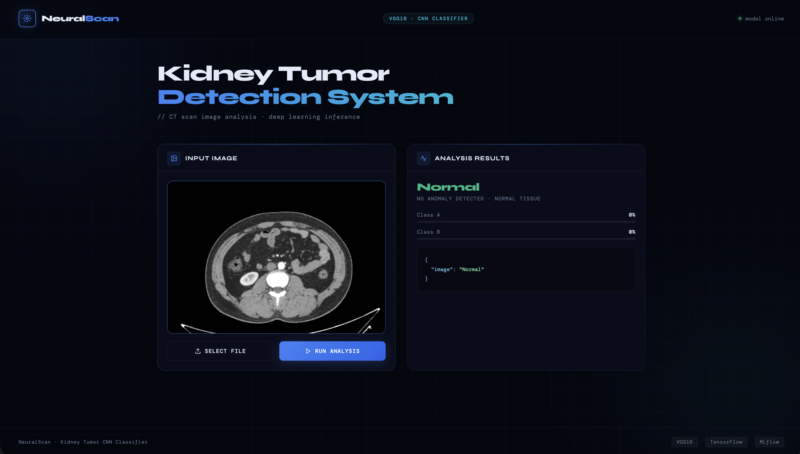
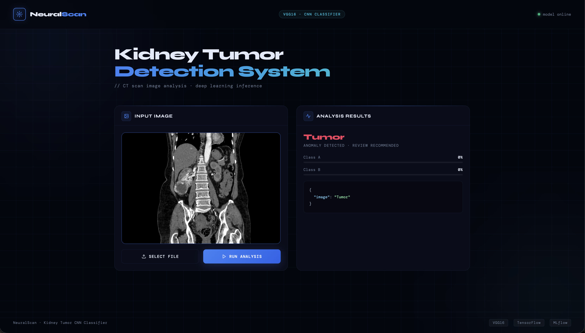
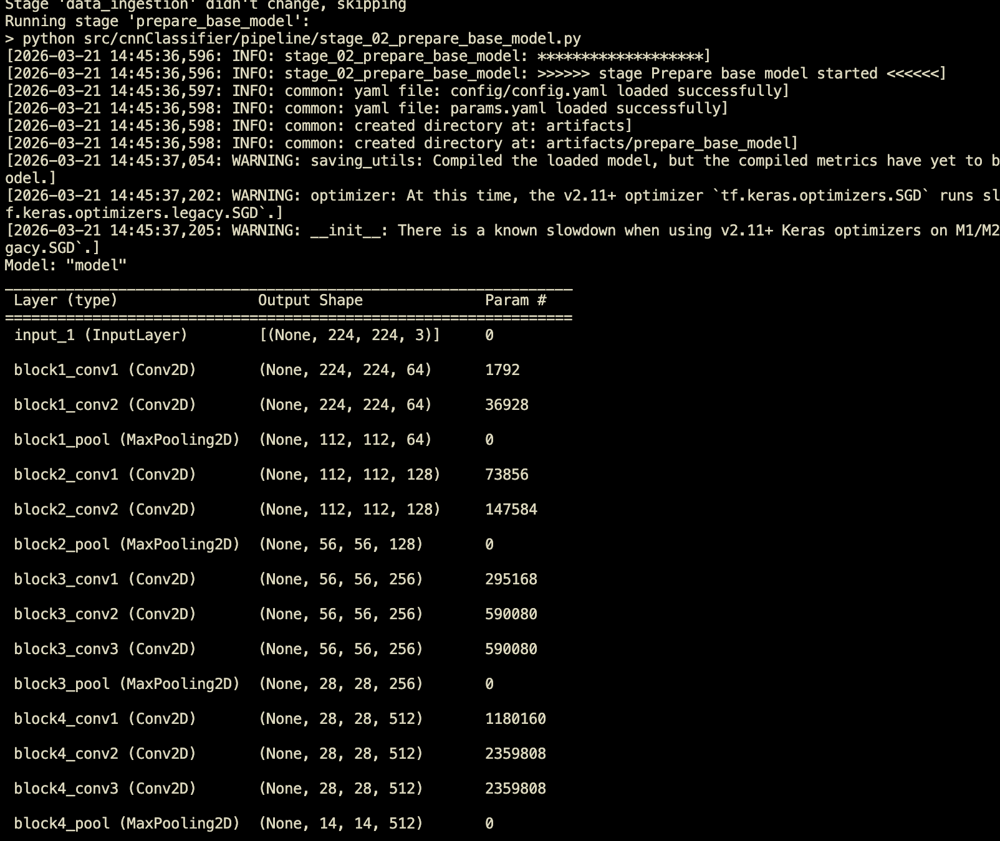
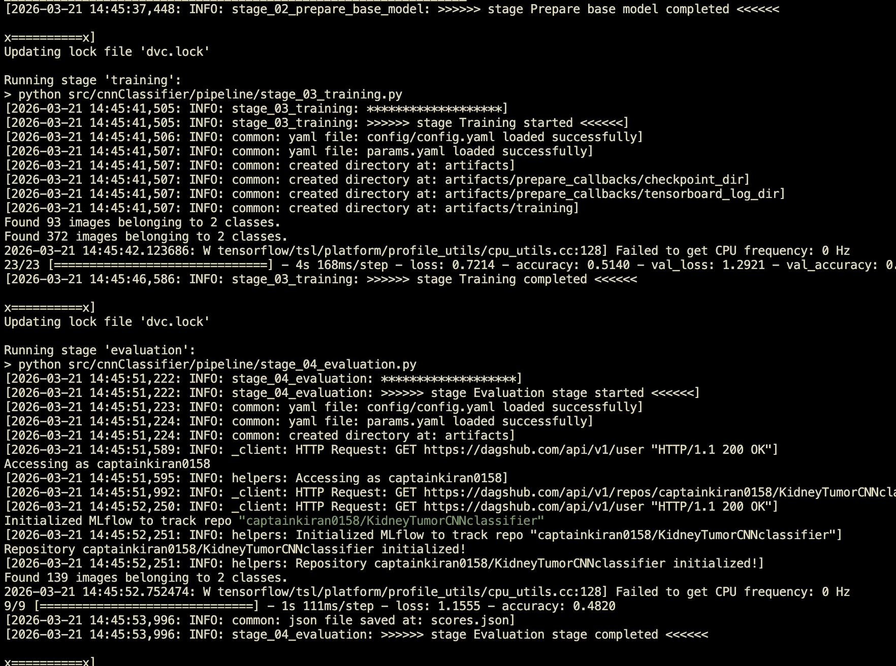

# Kidney Tumor CNN Classifier

## 1. Introduction

The **Kidney Tumor CNN Classifier** is a deep learning-based computer vision application designed to automatically classify kidney CT scan images as either **Normal** or **Tumor**. This project leverages transfer learning with VGG16 architecture, pre-trained on ImageNet, to build an efficient and accurate classification model.

The application is built using a modular MLOps pipeline that encompasses data ingestion, model preparation, training, evaluation, and deployment. This architecture ensures reproducibility, scalability, and production-readiness.

|Normal|Tumor|
|-|-|
|||

### Key Features

- **Transfer Learning**: Utilizes pre-trained VGG16 model for improved accuracy with limited data
- **Data Augmentation**: Implements image augmentation techniques to enhance model generalization
- **Modular Pipeline Architecture**: Organized stages for data ingestion, base model preparation, training, and evaluation
- **MLOps Integration**: Incorporates MLflow for experiment tracking and DVC for data versioning
- **Web Interface**: Flask-based UI for easy model inference
- **Automated Callbacks**: TensorBoard integration for training visualization and model checkpointing

---

## 2. Summary Overview

This project implements an end-to-end machine learning pipeline for kidney tumor classification. The workflow consists of the following stages:

1. **Data Ingestion**: Downloads and extracts kidney CT scan images from Google Drive
2. **Base Model Preparation**: Loads and customizes the VGG16 model for binary classification
3. **Training**: Trains the model with data augmentation and callbacks for monitoring
4. **Evaluation**: Evaluates the model performance on validation data
5. **Inference**: Provides predictions through a web interface

### Model Architecture

- **Base Model**: VGG16 (pre-trained on ImageNet)
- **Input Size**: 224x224x3 (as per VGG16 requirements)
- **Output Classes**: 2 (Normal, Tumor)
- **Training Epochs**: 12
- **Batch Size**: 16
- **Learning Rate**: 0.001

### Target Metrics

- Binary classification accuracy and loss
- Validation metrics tracked via MLflow and TensorBoard

---

## 3. Project Repository Structure

```
KidneyTumorCNNclassifier/
├── artifacts/                          # Training artifacts and outputs
│   ├── data_ingestion/                 # Downloaded dataset
│   │   └── kidney-ct-scan-image/
│   │       ├── Normal/                 # Normal kidney scans
│   │       └── Tumor/                  # Tumor kidney scans
│   ├── prepare_base_model/             # Model checkpoints
│   │   ├── base_model.h5
│   │   └── base_model_updated.h5
│   ├── prepare_callbacks/              # Callback outputs
│   │   ├── checkpoint_dir/
│   │   │   └── model.h5
│   │   └── tensorboard_log_dir/        # TensorBoard logs
│   └── training/
│       └── model.h5                    # Final trained model
│
├── config/
│   └── config.yaml                     # Configuration file with paths
│
├── src/
│   └── cnnClassifier/
│       ├── __init__.py                 # Logger initialization
│       ├── components/                 # Core ML components
│       │   ├── data_ingestion.py       # Data download and extraction
│       │   ├── prepare_base_model.py   # Model customization
│       │   ├── prepare_callbacks.py    # Callbacks setup
│       │   ├── training.py             # Model training logic
│       │   └── evaluation.py           # Model evaluation & MLflow integration
│       ├── config/
│       │   └── configuration.py        # Configuration management
│       ├── entity/
│       │   └── config_entity.py        # Config data classes
│       ├── pipeline/                   # Orchestration pipelines
│       │   ├── stage_01_data_ingestion.py
│       │   ├── stage_02_prepare_base_model.py
│       │   ├── stage_03_training.py
│       │   ├── stage_04_evaluation.py
│       │   └── predict.py              # Inference pipeline
│       └── utils/
│           └── common.py               # Utility functions
│
├── templates/
│   └── index.html                      # Web UI for inference
│
├── research/                           # Jupyter notebooks for experimentation
│   ├── 01_data_ingestion.ipynb
│   ├── 02_base_model.ipynb
│   ├── 03_prepare_callbacks.ipynb
│   ├── 04_training.ipynb
│   ├── 05_model_eval.ipynb
│   └── trials.ipynb
│
├── main.py                             # Main pipeline orchestrator
├── params.yaml                         # Model hyperparameters
├── config.yaml                         # Configuration paths
├── dvc.yaml                            # DVC pipeline definition
├── pyproject.toml                      # Project dependencies
├── requirements.txt                    # Python dependencies
├── setup.py                            # Package setup
└── README.md                           # This file
```

---

## 4. Configuration

### `config/config.yaml`

Contains paths for artifacts and data directories:

```yaml
artifacts_root: artifacts

data_ingestion:
  root_dir: artifacts/data_ingestion
  source_URL: https://drive.google.com/file/d/1vlhZ5c7abUKF8xXERIw6m9Te8fW7ohw3/view?usp=sharing
  local_data_file: artifacts/data_ingestion/data.zip
  unzip_dir: artifacts/data_ingestion

prepare_base_model:
  root_dir: artifacts/prepare_base_model
  base_model_path: artifacts/prepare_base_model/base_model.h5
  updated_base_model_path: artifacts/prepare_base_model/base_model_updated.h5

prepare_callbacks:
  root_dir: artifacts/prepare_callbacks
  tensorboard_root_log_dir: artifacts/prepare_callbacks/tensorboard_log_dir
  checkpoint_model_filepath: artifacts/prepare_callbacks/checkpoint_dir/model.h5

training:
  root_dir: artifacts/training
  trained_model_path: artifacts/training/model.h5
```

### `params.yaml`

Contains model hyperparameters:

```yaml
AUGMENTATION: True # Enable data augmentation
IMAGE_SIZE: [224, 224, 3] # VGG16 input size
BATCH_SIZE: 16 # Training batch size
INCLUDE_TOP: False # Exclude classification head from base model
EPOCHS: 12 # Number of training epochs
CLASSES: 2 # Binary classification
WEIGHTS: imagenet # Pre-trained weights
LEARNING_RATE: 0.001 # Optimizer learning rate
```

---

## 5. Setup

### Prerequisites

- **Python**: 3.8 or higher
- **macOS/Linux/Windows** with sufficient disk space (~5GB for dataset)
- **GPU** (optional, but recommended): Metal GPU on macOS or CUDA on Linux/Windows

### Installation Steps

#### 1. Clone the Repository

```bash
git clone <repository-url>
cd KidneyTumorCNNclassifier
```

#### 2. Create Virtual Environment

```bash
python3 -m venv .venv
source .venv/bin/activate  # On Windows: .venv\Scripts\activate
```

```bash
uv venv .venv --python 3.10
source .venv/bin/activate 
```

#### 3. Install Dependencies

```bash
pip install --upgrade pip
pip install -r requirements.txt
or
uv add -r requirements.txt
or
uv pip install -r requirements.txt

```

Or using pyproject.toml:

```bash
pip install -e .
```

### Key Dependencies

- `tensorflow-macos==2.12.0` / `tensorflow-metal>=1.2.0` (for macOS GPU support)
- `tensorflow>=2.12.0` (alternative for other platforms)
- `flask>=2.3.3` and `flask-cors>=5.0.0` (for web interface)
- `mlflow` (experiment tracking)
- `dvc>=3.42.0` (data versioning)
- `numpy`, `pandas`, `tqdm`, `pyyaml`, `python-box`

---

## 6. Running the Pipeline

### Option A: Run Complete Pipeline

Execute all stages sequentially:

```bash
cd /Users/kiranprasadjp/Documents/Pros/KidneyTumorCNNclassifier
source .venv/bin/activate
python main.py
```

This will execute:

1. **Stage 1**: Data Ingestion (downloads and extracts dataset)
2. **Stage 2**: Prepare Base Model (loads and customizes VGG16)
3. **Stage 3**: Training (trains the model)
4. **Stage 4**: Evaluation (evaluates and logs metrics)

### Option B: Run Individual Stage

#### Stage 1: Data Ingestion

```bash
python -c "from src.cnnClassifier.pipeline.stage_01_data_ingestion import DataIngestionTrainingPipeline; DataIngestionTrainingPipeline().main()"
```

#### Stage 2: Prepare Base Model

```bash
python -c "from src.cnnClassifier.pipeline.stage_02_prepare_base_model import PrepareBaseModelTrainingPipeline; PrepareBaseModelTrainingPipeline().main()"
```

#### Stage 3: Training

```bash
python -c "from src.cnnClassifier.pipeline.stage_03_training import ModelTrainingPipeline; ModelTrainingPipeline().main()"
```

#### Stage 4: Evaluation

```bash
python -c "from src.cnnClassifier.pipeline.stage_04_evaluation import EvaluationPipeline; EvaluationPipeline().main()"
```

### Option C: Use DVC Pipeline

If DVC is configured:

```bash
dvc repro
```
|Ingestion & Base model|Training & Evaluation|
|-|-|
|||
---

## 7. Model Training and Evaluation

### Training Process

The training pipeline includes:

1. **Data Loading**: Images loaded from `artifacts/data_ingestion/kidney-ct-scan-image/`
2. **Data Augmentation** (if enabled):
   - Random rotations, shifts, and zoom
   - Brightness adjustments
   - Horizontal and vertical flips
3. **Model Architecture**:
   - VGG16 backbone (pre-trained on ImageNet)
   - Custom classification head removed (`INCLUDE_TOP: False`)
   - Top dense layers added for binary classification
4. **Training Configuration**:
   - Optimizer: Adam with learning rate 0.01
   - Loss: Binary crossentropy
   - Validation split: 20%
   - Batch size: 16 samples
   - Epochs: 12

### Training Monitoring

#### TensorBoard

View training progress in real-time:

```bash
tensorboard --logdir=artifacts/prepare_callbacks/tensorboard_log_dir
```

Then open `http://localhost:6006` in your browser.

#### MLflow

Track experiments and metrics:

```bash
mlflow ui
```

Then open `http://localhost:5000` in your browser.

### Evaluation Metrics

The evaluation stage computes:

- **Accuracy**: Percentage of correct predictions
- **Loss**: Binary crossentropy loss on validation set
- **Precision, Recall, F1-Score**: For both classes (Normal, Tumor)
- **Confusion Matrix**: True positives, true negatives, false positives, false negatives

Metrics are logged to:

- `artifacts/training/evaluation_metrics.json` (with MLflow integration)
- TensorBoard logs for visualization

---

## 8. Deployment & Inference

### Model Inference

#### Option A: Using Prediction Pipeline

```python
from src.cnnClassifier.pipeline.predict import PredictionPipeline

predictor = PredictionPipeline()
result = predictor.predict("path/to/ct_scan.jpg")
print(result)
```

#### Option B: Using Flask Web Interface

1. **Start Flask Server**:

```bash
python app.py  # (if app.py exists)
# or manually with Flask
export FLASK_APP=app.py
flask run
```

2. **Access Web UI**: Open `http://localhost:5000` in your browser

3. **Upload Image**:
   - Use the upload button in the web interface
   - Supported formats: JPG, PNG
   - Recommended size: 224x224 or larger

4. **View Results**:
   - Display predicted class (Normal/Tumor)
   - Show confidence score
   - Display processed image


### Model Artifacts

Trained models are saved in:

- **Best Model**: `artifacts/training/model.h5`
- **Checkpoints**: `artifacts/prepare_callbacks/checkpoint_dir/model.h5`
- **Base Model**: `artifacts/prepare_base_model/base_model_updated.h5`

### Production Deployment

#### Docker Support (Optional)

To containerize the application:

```dockerfile
FROM python:3.8-slim

WORKDIR /app
COPY requirements.txt .
RUN pip install -r requirements.txt

COPY . .

CMD ["flask", "run", "--host=0.0.0.0"]
```

#### API Endpoints (if Flask app exists)

```
POST /predict
Content-Type: application/json

{
  "image": "<base64-encoded-image>"
}

Response:
{
  "prediction": "Tumor",
  "confidence": 0.95,
  "class_index": 1
}
```

---

## Usage Examples

### Training from Scratch

```bash
source .venv/bin/activate
python main.py
```

### Viewing Training Progress

```bash
# Terminal 1: Training
python main.py

# Terminal 2: Monitor with TensorBoard
tensorboard --logdir=artifacts/prepare_callbacks/tensorboard_log_dir

# Terminal 3: Monitor with MLflow
mlflow ui
```

### Making Predictions

```python
from src.cnnClassifier.pipeline.predict import PredictionPipeline
from PIL import Image

predictor = PredictionPipeline()
result = predictor.predict("sample_kidney_scan.jpg")
print(f"Prediction: {result['class']} with confidence {result['confidence']:.2%}")
```

---

## Troubleshooting

### Issue: TensorFlow GPU not detected on macOS

**Solution**: Ensure `tensorflow-metal` is installed

```bash
pip install tensorflow-metal>=1.2.0
```

### Issue: Data download fails

**Solution**: Check Google Drive link in `config/config.yaml` is accessible and file ID is correct

### Issue: Out of Memory during training

**Solution**: Reduce `BATCH_SIZE` in `params.yaml` (try 8 instead of 16)

### Issue: Model accuracy too low

**Solution**:

- Increase `EPOCHS` in `params.yaml`
- Ensure data is properly downloaded and extracted
- Check image dimensions match `IMAGE_SIZE` parameter
- Enable/verify `AUGMENTATION: True`

---

# AWS-CICD-Deployment-with-Github-Actions

## 1. Login to AWS console.

## 2. Create IAM user for deployment

	<!-- with specific access -->

	1. EC2 access : It is virtual machine

	2. ECR: Elastic Container registry to save your docker image in aws


	<!-- Description: About the deployment -->

	1. Build docker image of the source code

	2. Push your docker image to ECR

	3. Launch Your EC2 

	4. Pull Your image from ECR in EC2

	5. Lauch your docker image in EC2

	<!-- Policy: -->

	1. AmazonEC2ContainerRegistryFullAccess

	2. AmazonEC2FullAccess

	
## 3. Create ECR repo to store/save docker image
    - Save the URI: 

	
## 4. Create EC2 machine (Ubuntu) 

## 5. Open EC2 and Install docker in EC2 Machine:
	
	
	#optinal

	sudo apt-get update -y

	sudo apt-get upgrade
	
	#required

	curl -fsSL https://get.docker.com -o get-docker.sh

	sudo sh get-docker.sh

	sudo usermod -aG docker ubuntu

	newgrp docker
	
# 6. Configure EC2 as self-hosted runner:
    setting>actions>runner>new self hosted runner> choose os> then run command one by one


# 7. Setup github secrets:

    AWS_ACCESS_KEY_ID=

    AWS_SECRET_ACCESS_KEY=

    AWS_REGION = us-east-1

    AWS_ECR_LOGIN_URI = demo>> 

    ECR_REPOSITORY_NAME = simple-app


## Project Team & References

- **Framework**: TensorFlow/Keras
- **Base Architecture**: VGG16 (ImageNet pre-trained)
- **MLOps Tools**: MLflow, DVC, DagHub
- **Data Source**: Kidney CT scan images from Google Drive

---

## License

This project is provided as-is for educational and research purposes.

---
